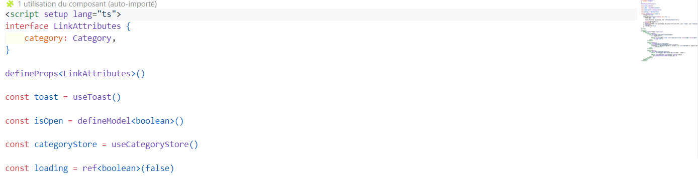
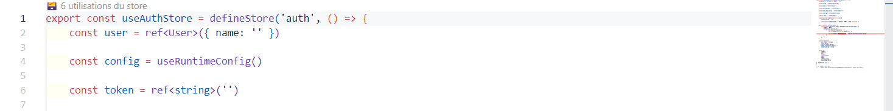

# 🔍 Nuxt Intellisense

**An extension for VS Code that revolutionizes your Nuxt 3 development experience**

## ✨ Key Features

### 📊 Smart Visualization

- **Real-time reference count** for:
  - 🧩 Vue/Nuxt components (including custom components in the `pages` folder)
  - 🔄 Composables
  - 🗃️ Pinia stores
  - 🖼️ Layouts
  - 🔌 Plugins (including custom directives)
  - 🔗 Middlewares
  - 🔧 Utility files such as `utils`, `lib`, `helpers`, `constants`, etc.

### 🎯 Nuxt 3 Precision

- Detection of **auto-imports** across components and composables.
- Support for **multi-line components** (components with multiple lines and dynamic usage).
- Fully compatible with **TypeScript** and **JavaScript** for enhanced typing and error detection.

### ⚡ Seamless Integration

- **Highlighting** within the source file to easily locate references.
- **Quick navigation** to references by simply clicking on them.
- **Real-time updates** as you modify your code, keeping everything synced.

### 🛠 Troubleshooting

- If you encounter issues with the extension, try restarting VS Code after installation.
- Ensure that your Nuxt project is correctly configured with the `nuxt.config.js` file for the extension to recognize auto-imports.

## 🖥 Screenshot



_Visual representation of component and composable references in action._

## 🚀 Installation

1. Open VS Code
2. Go to the Extensions panel (Ctrl+Shift+X)
3. Search for "Nuxt Intellisense"
4. Click Install

## 💡 Practical Examples

```vue
<!-- 5 usages detected for the composable -->
export const useData() { }

<!-- 3 usages detected for the components -->
<script setup>
const { data } = useData()  <!-- Composable -->
</script>

<template></template>
```
